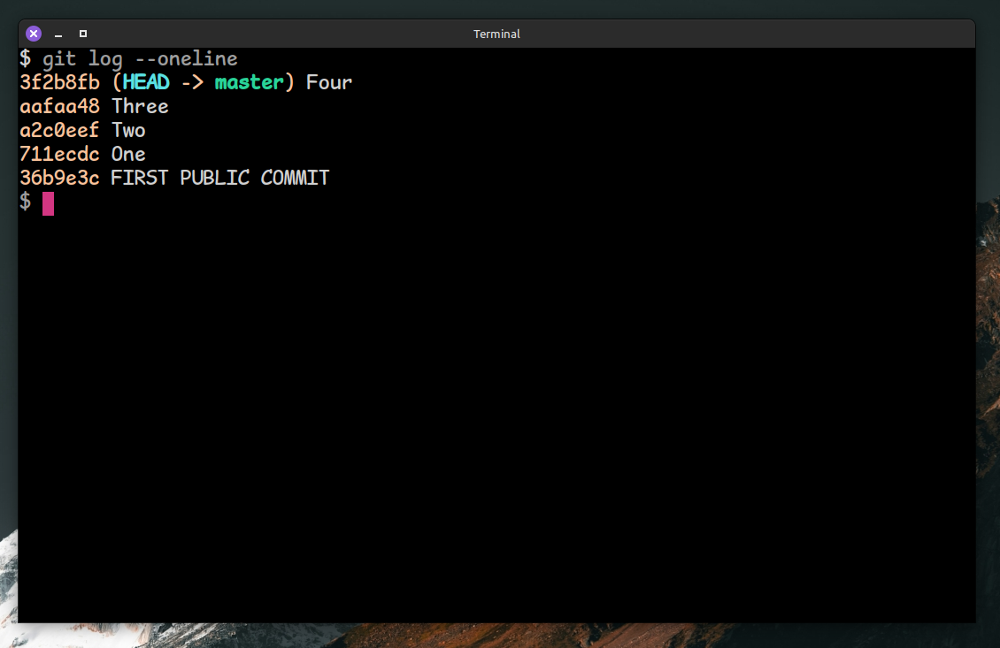

# Interactive Rebase Reverser

A Vim plugin to reverse the order of commits displayed during a git interactive rebase.

The default behaviour of git it to display *recent* commits at the top when using `git log` and *older* commits at the top when using `git rebase --interactive`. This can be confusing! Or unsettling!

This plugin fixes this. It shows you a reversed list of commits when editing the rebase file, but uses the usual order when writing to disk.

## Screenshots

### What your log normally looks like

### What your interactive rebase normally looks like

### What it will look like when using this plugin

As a visual cue for making it easier for you to notice when you are editing a regular rebase file, say, in a remote machine, a comment is added to the first line of buffer. The default wall of comments git adds at the bottom of the file is also removed.

## Installation

Use your favorite plugin manager. For example, for vim-plug:

- Add `Plug 'salcode/interactive-rebase-reverser'` to .vimrc
- Run `:PlugInstall`

## Further reading

[Git Interactive Rebase Order is Wrong](https://salferrarello.com/git-interactive-rebase-order-is-wrong)
